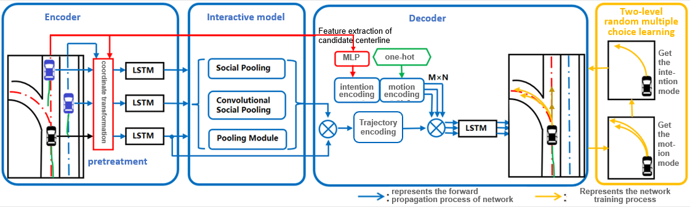
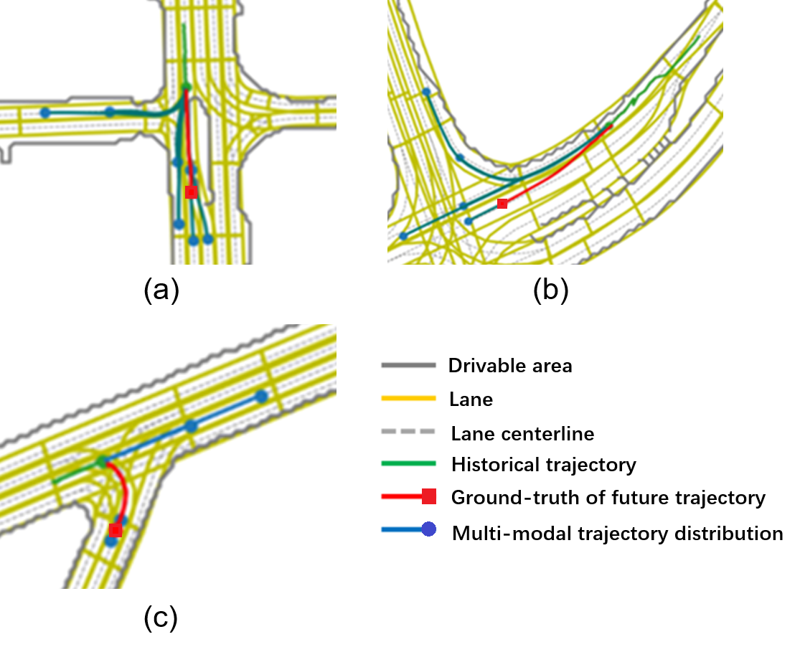

# vehicle trajectory prediction by collaborative learning

This repository is the PyTorch implementation for the framework of **vehicle trajectory prediction by collaborative learning**.

We will upload the code after the paper is accepted

<!-- 

   

 -->

## Abstract

Comming soon......

## Framework

## Setup
Comming soon......

## Usage
Comming soon......

## Experimental results

### Qualitative results

  
    

<!-- ### Quantitative results

  
    

 -->

## Citation

If you find this project useful in your research, please consider citing us.  

Comming soon...

